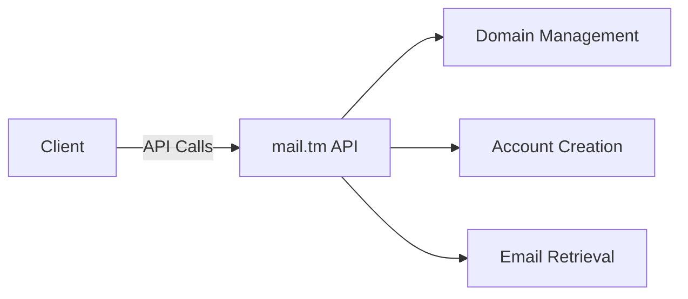

# Temp Mail Pro - Disposable Email Service


## 🌟 Overview
Temp Mail Pro is a web application that provides temporary, disposable email addresses, perfect for:
- Website registrations
- Email verifications
- Protecting your primary email from spam
- Maintaining privacy online

## 🚀 Features

### ✨ Core Features
- **Automatic Email Generation**: Instantly create random email addresses
- **Custom Usernames**: Option to specify your preferred username
- **Full Inbox Management**: View, read, and organize received emails
- **HTML Email Support**: Safe rendering of HTML messages in sandboxed iframes
- **Multiple Accounts**: Manage several disposable emails simultaneously
- **Auto-Refresh**: Inbox updates every 15 seconds (with visual progress indicator)

### 🔐 Account Management
| Feature | Description |
|---------|-------------|
| Create Accounts | Random or custom username options |
| Edit Accounts | Change usernames anytime |
| Delete Accounts | Remove accounts with one click |
| Copy Email | Instant copy to clipboard |
| Account History | View creation and last-used dates |

### 🎨 User Experience
- **Dark/Light Mode**: Toggle between color schemes
- **Visual Notifications**: Snackbar alerts for actions
- **Sound Alerts**: Optional notification sounds
- **Responsive Design**: Works on all device sizes
- **Intuitive UI**: Material Design inspired interface

## 🛠️ Technical Implementation

### Frontend
- Vanilla HTML5, CSS3, JavaScript (no frameworks)
- CSS Variables for easy theming
- Material Icons integration
- Fully responsive layout

### Backend Integration


## Data Flow
1. User requests new email
2. App queries mail.tm for available domains
3. Creates account with generated credentials
4. Stores account info in localStorage
5. Periodically checks for new messages

## 📖 How to Use

### Basic Usage
1. Click "Create Email"
2. Choose random or custom username
3. Copy your new temporary email
4. Use it for registrations/verifications
5. View incoming messages in your inbox

## Advanced Features

### Account management tips:
- Click account to switch
- Hover over buttons for tooltips
- Right-click messages for actions

## 📦 Installation
No installation required! Simply:
1. Open `index.html` in any modern browser
2. Start using temporary emails immediately

*(For developers:)*  
To modify the project:
```bash
git clone https://github.com/agaggsgsfsfwcau/tempmailpro.git
cd temp-mail
# Edit files as needed
```

## 📜 License
MIT License - Free for personal and commercial use

---
